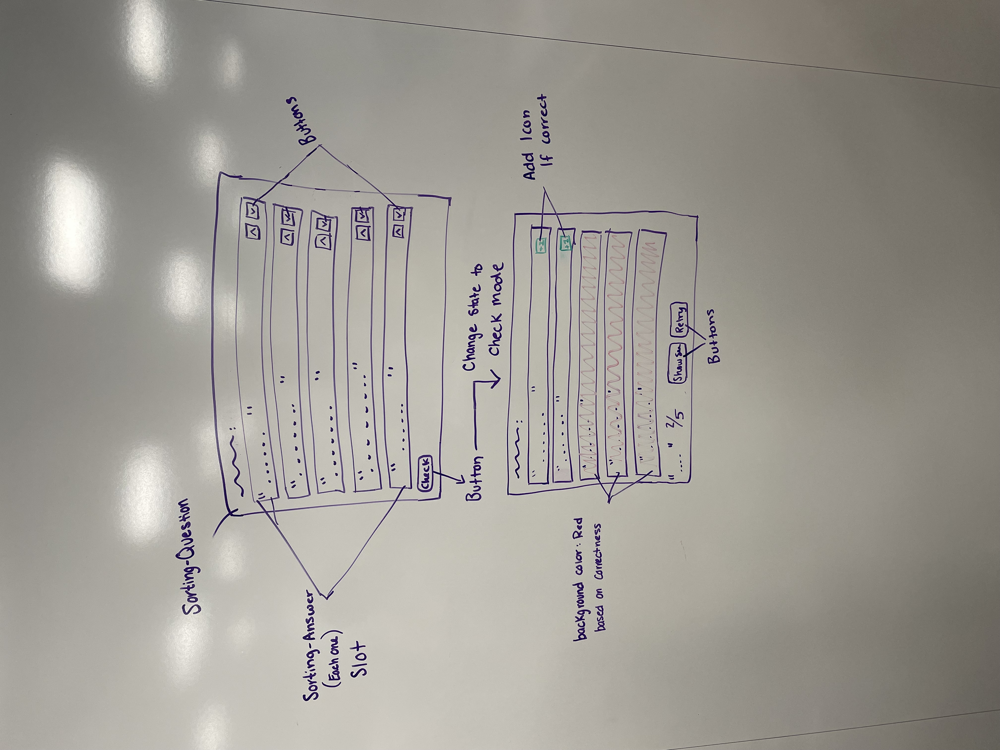

# Team notes
This is for maintaining communication about your team's working meetings to "ship" the project.

## Meeting notes
These are notes to be maintained PER date that you meet. What you did and what the next steps are
### Meeting Date

#### What we did:

#### What we'll do next

## Status check ins
These are dedicated status check-ins as this is a multi-week project
### Check-in 1

What project / issue your picking (link to it)
- we chose to do the sorting card questions: https://github.com/elmsln/issues/issues/872
- A hand drawn / computer sketch / XD / some annotation visually of what needs to be done or what pieces get broken out. This could be drawn on over top of a screen shot of the item or a photo of whiteboard sketches. Whatever make the most sense to you.
Initial questions / unknowns
- what would be the best way to go about this to keep our run time fast
- what would be the best way to go about this to keep our code simple and easy to read 
- What languange will be most vital to build the function 
- How do we get our code to return a value to see if it is correct or not?
What elements do you expect are needed for this design?
- the design elements 
- a sorting card with a general design to it 
- icon elements 
- banner elements to show if you were right or wrong 
- body and header and sub header elements 
What properties do you expect these to have?
- different colors, fonts, text sizes, inverted colors, page layout, display, clickable, maybe play audio 
Slots?
- yes, we will need slots our different elements that we want to implement 
- like the body, icons, subheaders, headers and more 
What CSS / Styling unknowns are there presently?
- how to format the card to make it clear to the user what is happening 
What states does it have? can you click / hover to engage with it?
- it will be clickable 
- we want the card to flip to see if the anwser was correct 
- hovering over the card will change the color to indicate to the user that it is being hoovered over 
What properties need mapped to HAX / the storybook? What can the user interact with?
- the user will be able to interact with flipping the card 
- be able to drag and drop cards into different piles of right and wrong 

### Check-in 2
- We do not really plan to deligate work because this project entails more logic than a bunch of different elements 
- we plan to keep meeting VIA Zoom to collaborate on the code together at least twice a week 
- we had made a really good prototype and have a good layout on how we want to go about working on this code 
- conceptualized our vision 
- everyone took notes from class on how we could go about this best 
- we planned what we want to do next to make sure we kept on track 
### Check-in 3
- Project is currently being worked on to ellude feedback on progess
- Class activity resulted in a good insight to give the user capabilities to use keyboard input along with click events
- Next steps are to get the project together visually then put together logic behind sorting and answer checking
- Will have at least visuals done by class tuesday, and if time allows, some logic and functionality
### Check-in 4
- 
- 
